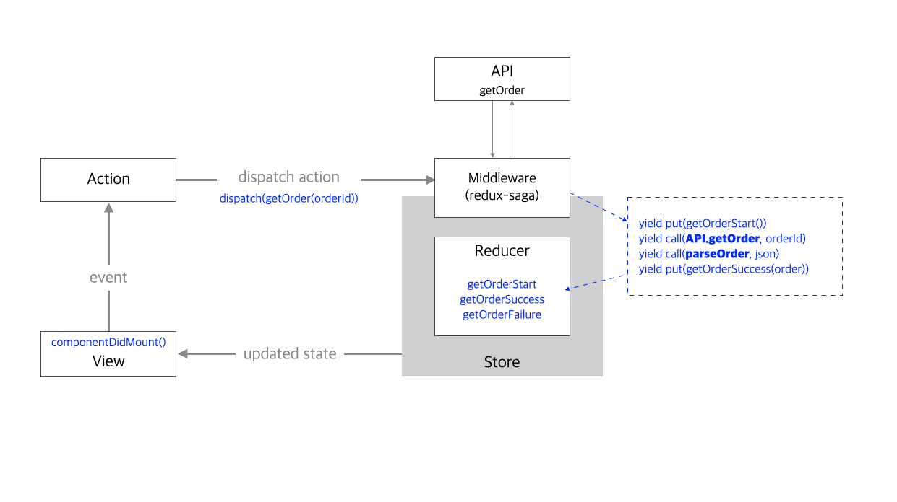

# Ncode App

디코드 서비스 리팩토링

### 프로그램 구조



- 서버에서 받을 데이터 포멧 변경시, parseOrder() 에서 데이터 가공 하여 Store에 저장

  ```typescript
  // ./src/ducks/order/orderSaga.ts

  function parseOrder(json: any) {
    return new Promise(function (resolve, reject) {
      setTimeout(function () {
        try {
          const order: Order = {
            id: json.id,
            orderAt: new Date(json.orderAt),
            amount: json.amount,
            shippings: json.shippings,
          };
          resolve(order);
        } catch (error) {
          reject(Error(error.message));
        }
      }, 3000);
    });
  }
  ```
